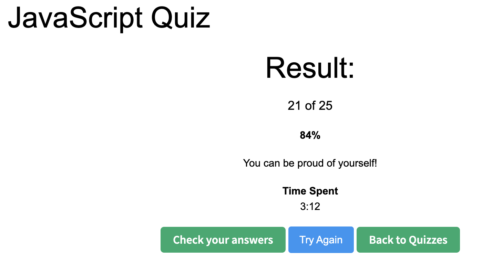
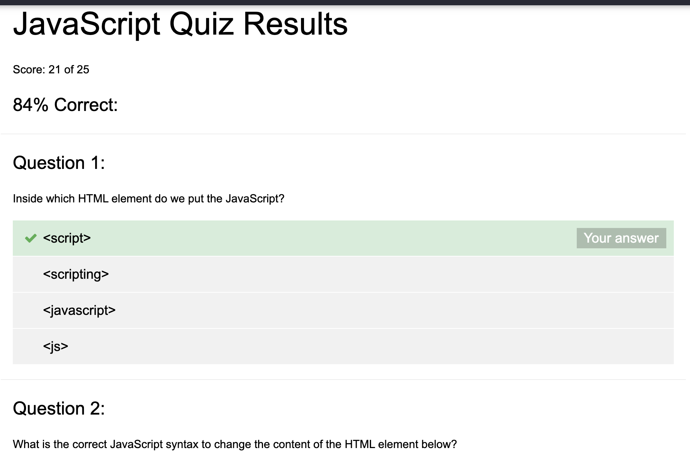

# Week 1, spring semester

# Welcome

Welcome new students and old. 

# Quiz time 

Open and take each one. 

https://www.w3schools.com/quiztest/quiztest.asp?qtest=HTML
https://www.w3schools.com/quiztest/quiztest.asp?qtest=CSS
https://www.w3schools.com/quiztest/quiztest.asp?qtest=JS

# Once done, email me the results

Adam.Bourg@Gmail.com

Here's what the results page looks like:

Click the "Check your answers" page and email me a PDF copy of the page. Here's what the page looks like:

# Once we're done with all 3 quizes, what's next? 

TBD, We'll deicde what to do together. 

Options: 
* HTML & CSS deep dive
* Javascript deep dive
* Build a simple weather APP
